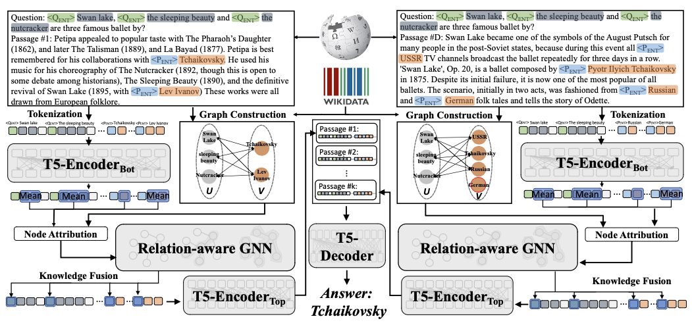

# Source Code for GRAPE:grapes:



Hi all, this is the official repository for EMNLP'22 paper: **GRAPE:grapes: : Knowledge Graph Enhanced Passage Reader for Open-domain Question Answering**. We sincerely apprecaite your interests in our projects!

## Instruction 

To run our experiments, first please put the data folder in current directory like this:
```
GRAPE
|   README.md
|   train_reader.py    
|
|----src
|    |   data.py
|    |   evaluation.py
|    |   model.py
|    |   ...
|       
└----bash
|    |   script_multi_gpu.sh  # Multi-GPU training and evaluation
|
|----data # download from the data source
     |
     |----graphs
     |    |   bin_files
     |    |   ...   
     |
     |----json_input
          |    |   jsonl_input_data
          |    |   relation_json 
          |    |   test_relation_json # to test the EM on the subset where examples are fact-enhanced
```
With the directory structured like above, you can simply run:

```
cd bash
bash script_multi_gpu.sh # Multi-GPU
```

- For the multi-GPU version please change **CUDA_VISIBLE_DEVICES** and **--nproc_per_node** accordingly. 
- Changing **--n_context** requires different graph files. (In this demo we only support **--n_context 100**)  
- Ablation experiments can be tested by setting **--gnn_mode** to "NO_RELATION" or "NO_ATTENTION".

The GPU consumption can be found in our paper.

(roughly 30GB for large config with **--per_gpu_batch_size** set to 1, and 29GB for base config with **--per_gpu_batch_size** set to 3)

## Dependencies
The main libraries we utilize are:

- torch===1.11.0
- transformers==4.18.0
- dgl==0.8.2
- sentencepiece

## Data
To reproduce our results, please download the data folder from this google drive [[drive link]](https://drive.google.com/drive/folders/1-MYadjSWi8_3nl8vgtK_Dvja43IQGyHp?usp=sharing).

Inside the data folder are the json inputs as well as DGL graphs. We are still cleaning the code for data pre-processing and it is not included in this repository. Please contact the authors for these code. 

## Credit 
We modified our code from the repository of Fusion-in-Decoder (FiD) [[repo]](https://github.com/facebookresearch/FiD).

## Contact

Mingxuan Ju (mju2@nd.edu), Wenhao Yu (wyu1@nd.edu)
